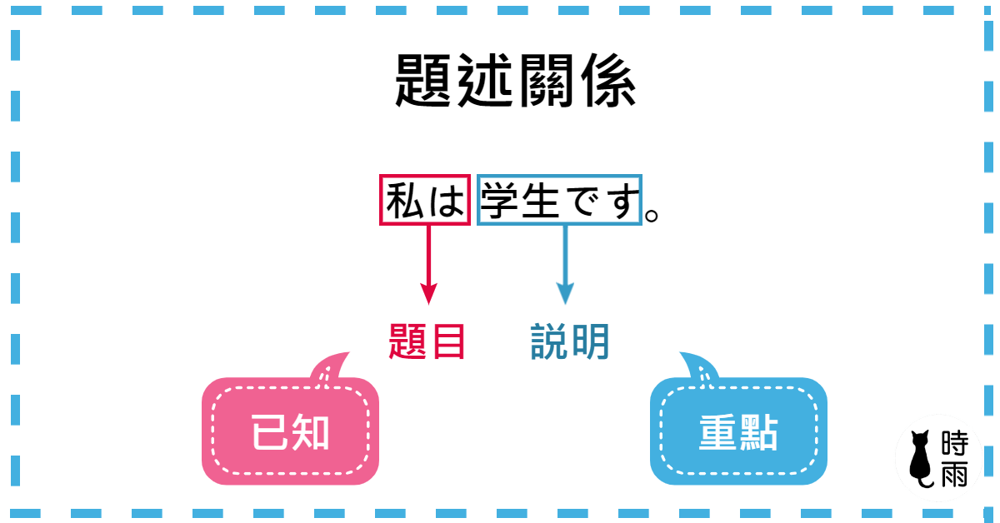
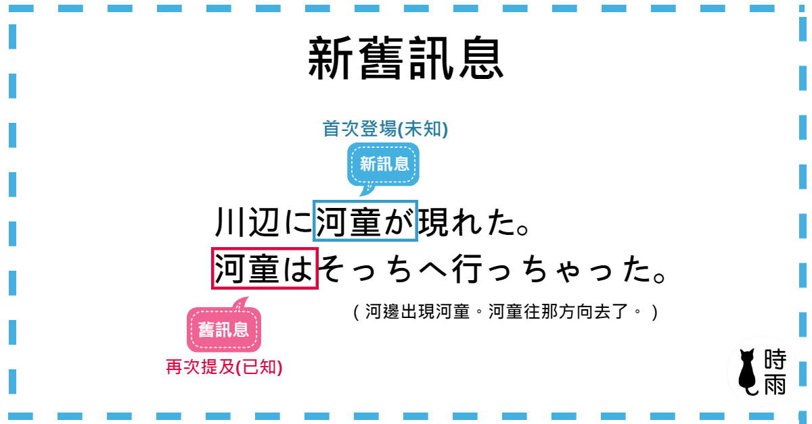
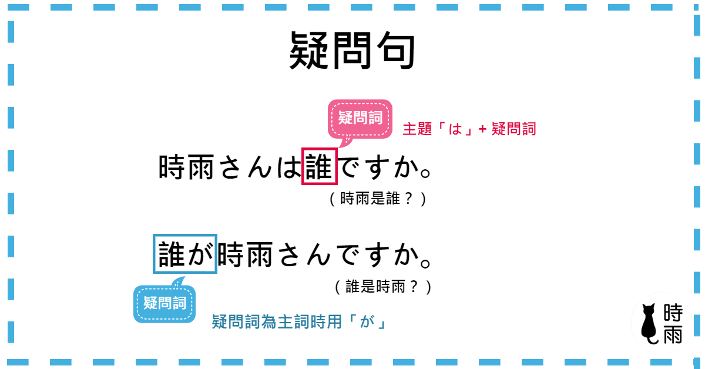
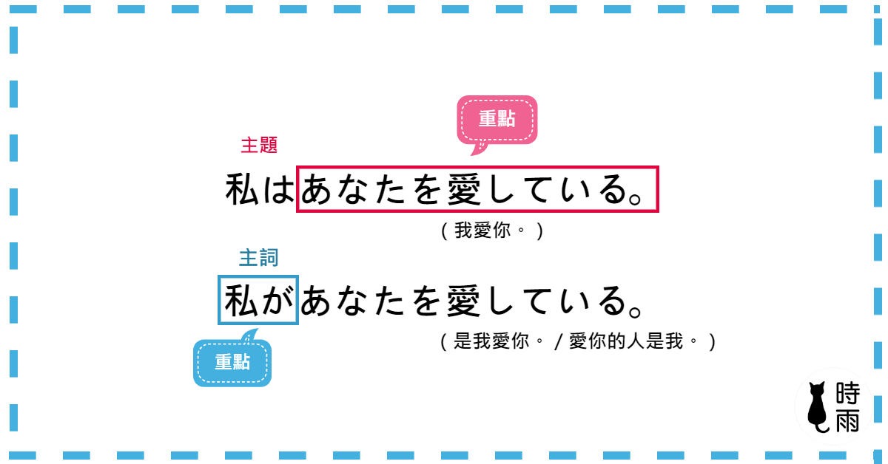
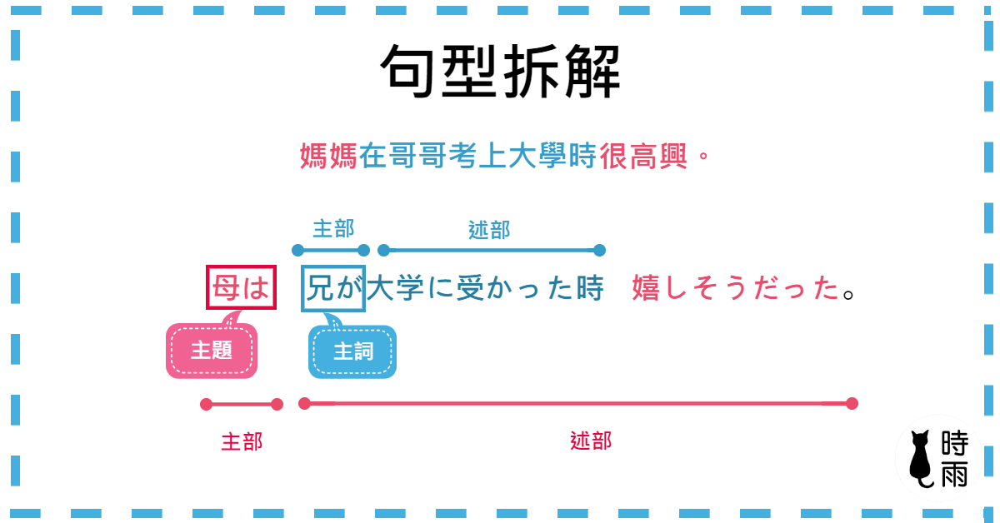

# 助词
## 「は」
### 提示说明句的主体
说明句中は所提示的主题是属于说话者与听话者都已知的事物，然后对于已知的主题来加以说明与叙述。  


* 例:  
1. お父さん`は`課長に昇進しました。  
爸爸升任课长了。→ 主题是「爸爸」，爸爸怎么了? → 升任科长【说明】  
2. 日本`は`物価が高いです。  
日本物價很高。→　主題是「日本」，日本怎樣？ → 物價很高【説明】  
### 表示旧信息的主题  
旧信息为对话者们之前已经提及过的信息，再次提及时便为旧信息(对话者们已知的信息)，此时需要用「は」来提示主题。而如果是信息(第一次提到或是听话者还不知道的信息)则用「が」来提示。  

* 例:
1. むかしむかし、義真という名のお坊さん`が`いました。お坊さん`は`毎日たくさんのたきぎを背負って町に行きます。  
从前，有个名叫義真的和尚。和尚每天都背着木柴到城镇去。  
2. むかしむかし、あるところに、お爺さんとお婆さん`が`住んでいました。お爺さん`は`山へ柴刈りに、お婆さん`は`川へ洗濯に行きました。  
从前，有个地方住着老爷爷和老奶奶。老爷爷到山上去砍柴，老奶奶去河边洗衣服。  
### 表示两件事物的对比  
前后句的主题各自说明且相互照应时用「は」。  
* 例:
1. 兄`は`優秀だが、僕`は`優秀ではない。  
哥哥很优秀，但我不优秀。→ 兄弟对照  
2. 冬は寒いが，夏は暑いです。  
冬天很冷，夏天很热。→ 冬夏对比  
3. わたしは今日はサボったが、明日は必ず学校行く。  
我今天虽然翘课，但明天一定回去学校。  

这里的`が`是逆接助词(不是表主语的が)，意思是「虽然~但是~」。  
### 表述语疑问词的主题  
主題「は」+疑問詞可形成疑問句。當疑問詞為主詞時則用「が」，因為疑問詞是未知物，未知物無法作為主題(主语+は+疑问词/疑问词+が)。  


* 例: 
1. 富士山`はどこ`ですか。  
富士山在哪里?  
2. あの方`はどなた`ですか。  
请问那位是谁?  
3. タピオカミルクティー`はどんな`飲み物ですか。  
珍珠奶茶是什么样的饮料?  
4. `どこが`富士山ですか。  
哪里是富士山?  
### 表示强调或暗示  
其實「は」就是表示主題的意思，會說強調或暗示是因為原本的助詞不是「は」，或是在原本的助詞上又加上了「は」，這意味著把原本的內容轉換成主題，因此有從述語升級成主題的感覺，在許多情況下會簡單用強調或暗示的說法來說明。在接續方面，「は」可以取代原本的「が」跟「を」，但其他助詞如「で」、「に」、「へ」、「と」、「から」、「より」、「まで」，「は」則位於它們之後。  
* 例:  
1. 原句:私はリンゴ`を`食べました。(我，吃了苹果。)  
强调:私はリンゴ`は`食べました。(苹果，我吃了。)は替换了を  
2. 原句:私は英語`が`できません。(我不会英文。)  
强调:私は英語`は`できません。(英文，我不会。)は取代が  
3. 原句:日本へまだ行ったことがありません。(还没去过日本。)  
强调:日本へはまだ行ったことがありません。(日本，还没去过。)は置于へ之后  
4. 原句:ここ`で`タバコを吸ってはいけません。(这里禁止吸烟。)  
强调:ここ`では`タバコを吸ってはいけません。(在这里，禁止抽烟)は至于で之后。  
## 「が」
### 表示眼前的现象  
说话者描述看到的景象，用「が」表示主词，其焦点放在眼前所指的对象上进行说明。  
* 例: 
1. あ、月が出たよ。  
啊、月亮出来了喔！ → 指眼前看到的月亮，对当下发生的事情进行描述  
2. 警察が来たぞ。  
警察来了！→ 指眼前看到的警察，对当下发生的事情进行描述  
3. バスがやってきた!  
公交车来了！→ 指眼前看到的公交车，对当下的事情进行描述  
### 表排他  
排他意为只针对「が」所提示的部分。表示强调。  


* 例:  
1. 私が毎朝部屋をしています。  
我每天早上都在打扫房间。(排他：是我，不是别人)  
2. 森さんが責任者です。  
森就是负责人(排他: 是森，不是别人)  

會話方面  
當對方用疑問詞作為主詞時（例如「誰が～？」），回答時就用「が」來回應（例如「先生が～」）。
* 例:  
1. A:そこに誰がいますか。(谁在那边?)主语为疑问词+が  
B:田中さんがいます。(田中老师在那边。)回答时一样用が  
2. A:職員室はどこですか。(教职员室在哪里?)主语是「は」+ 疑問詞  
B:職員室はここです(教职员室在这里。)回答一样用は  
### 表连体修饰子句  
所謂的子句是指已經具有主部與述部的句子中，其述部又出現了主部和述部，這樣的述部就稱為子句。而連體修飾子句就是一個句子的述部已經有被修飾過的名詞（連體修飾），其主項目並非全句的主題，而是作為主詞，助詞使用「が」。  

  
主句中的主语部分使用`は`，子句中的主语部分使用`が`。  
复合句拆分
1. 母は嬉しいだった。(母亲很高兴)  
2. 兄は大学受かった時、嬉しいだった。(此处将`兄`后的`が`变为`は`此时子句就变成了一个完整的句子)  

## 「に」
### 表示动作发生的时间
```
时间性名词 + に ＋ 动词  
```
* 例:  
1. 私は毎日8時に起きます。  
2. 期末試験は金曜日に終わります。  
3. 夏休みに日本へ行きました。  
4. 私は２０００年に生まれした。  

也可使用「ころ(ごろ)」或「くらい(ぐらい)」表示时间：
ころ: 主要表示某个时间点(不可表示时间长度)  
くらい(ぐらい): 主要表示时间长度的左右，文章中多使用くらい口语中使用ぐらい。  
由于「くらい」表示的是程度上的量，因此用法比较广，也可用于表示数量上的大概。  
* 例：  
1. 10人ぐらい。
2. ５00円ぐらい。
3. 10歳ぐらい。
### 表归着点(变换位置的到达点)  
```
场所 + に + 动词 [表示动作到达的位置]
```
* 例:  
1. 日本に行きます。  
去日本。→ 归着点在日本  
2. 台北に着きました。  
到了台北。→ 归着点在台北
3. 電車に乗ります。  
搭乘电车。→ 归着点在电车
4. 黒板に字を書きました。  
把字写在黑板上。→ 字的归着点在黑板
5. 紙に名前を書きました。  
把名字写在纸上。→ 名字的归着点在纸上
### 表存在场所
```
场所 + に + 名词 + が + 存在动词 [表示有、存在的意思]
```
「いる/ある」是存在动词，皆表示「有、在」的意思，所谓的存在动词指动词本身并没有动作只是单纯的描述主词存在。一半用有无生命来判断，有生命使用「いる」，没有生命使用「ある」，对于「植物」、「鬼」等在不同见解下容易出错，最好的分辨方法是判断能自主移动的使用「いる」，无法自主移动的使用「ある」。  
* 例：  
1. 教室に学生がいる。  
教室里有学生。→ 学生有生命(可自主移动)，用「いる」  
2. 教室に机がある。  
教室里有桌子。→ 桌子没有生命(不可自主移动)「ある」  
### 表指向场所(指静态动作的指向场所)  
静态动词指相对没有明显动作的(几乎静止状态)动词，例如坐着「座る」坐着或「立つ」静止都属于静止的状态，其他常见的静态动词有「勤める、置く、住む、泊まる……等」;相反像是吃、喝、跑、跳等这种非常明显的动作就属于「动态动词」，动态动词的场所助词则使用「で」。  
* 例:  
1. 台北に住んでいます。  
2. 公園に座っています。  
3. 銀行に勤めています。  
### 表示转换结果(事物或状态转变的结果)  
```
名词 + に + 具有转变效果的动词(成为、转、便、改...等)
```
1. 部長になります。  
当上部长了。(なる：当上，成为)
2. 低血圧が高血圧に変わりました。  
低血压转变为高血压。  
3. 中国語を日本語に翻訳してください。  
请把中文翻译成日文。  
### 表对象(单向动作所指的对象)  
```
对象 + に + 动作[这里的动作为单向动作，即单方面的动作] 
```
* 例：
1. 昨日、先生に会いました。  
2. 後輩にお金を貸しました。  
3. 猫に餌をあげます。  
4. 友達に写真を見せました。  
### 表示次数(一个期间内包含的次数)
```
时间段 + に + 数量词 + 动词
```
1. この薬は一日に三回、毎食後に飲んでください。  
2. 週に一回読書会をやりましょう。  
3. 月に一度旅行します。  
4. 年に一回健康診断を受けます。  
### 表示目的(移动动词的目的)  
用作提示移动的目的。
```
动词第二变化(ます形去掉ます) + に + 移动动词 / (三类动词)动作性名词 + に + 移动动词
```
1. 家にも遊びに来てください。  
也来家里玩吧！(来家里的目的 → 玩)  
2. 映画を見に行きます。  
去看电影(去的目的 → 看电影)  
3. スーパーへ買い物に行きます。  
去超市买东西。(去超市的目的 → 买东西)  
4. 日本へ留学に行きます。  
去日本留学(去日本的目的。 → 留学)  
## 「へ」
### 表方向(变换位置的指向场所)  
```
场所 + へ + 移动动词
```
* 例:
1. 日本へ行きます。  
去日本。  
2. 家へ帰ります。  
回家。  
3. スマホをテーブルへ置きます。  
手机放在桌子上了。  

* 「に」和「へ」的差别  
表示变换位置时，「に」和「へ」都可以使用，意思几乎一样，差別在於「に」是表示「歸著點」，「へ」則表示「方向」。因此「日本に行く」是到日本（目標就是日本），而「日本へ行く」則是往日本的方向（中途可能還有去別的地方）。  
* 疑问句时的用法  
如果是「疑問詞 + か」 的問句時，由於這是「不確定的疑問」，回答為「はい（是）」或「いいえ(不是)」。如果問句只有「疑問詞」時則直接回答疑問詞的内容即可。  
    * 例:  
    1. A: 明日、どこかへ行きますか。  
    明天你要去哪里吗?(どこ + か: 不确定疑问。此处为不确定是不是要出门)  
    B: はい、行きます。  
    是的我要出去。  
    2. A: どこへ行きますか。  
    你要去哪里?(どこ: 确定疑问句。此处已经明确知道要出门，只是问出门的目的地)  
    B: 九分へ行きます。  
    我要去九分。  

### 表对象(单向动作指向的对象)  
```
对象 + へ + 动作 (这里的动作为单向作用)
```
* 例:
1. 親友へ手紙を書きました。  
写信给亲友。  
2. 参加者へのお知らせです。  
给参加者的信。  

* 「に」与「へ」的区别  
「に」的用法較為廣泛，而「へ」主要用於「給與」，並且「へ」可和「の」並用，「~~への」表示「給～的東西」，但是「に」不能和「の」並用。  
## 「と」
「と」可完全按照汉字「和」的意思理解无需过多的解读。  
## 「や」  
「や」和「と」的用法意思都是"和"表示列举，但是「と」需要列举众多事物的全部，而「や」只需要列举出众多事物中的一部分即可。  
```
名词 + や + 名词 + (など) [など可接可不接]
```
* 例：
1. 机の上に本やノートがあります。  
桌子上有书和笔记本。
2. 学校では、ウサギや亀なとの生き物が飼育されています。  
学校里养着兔子和乌龟等生物。(该句子主题是学校突出强调学校这个地方有兔子乌龟)。
3. コーヒーやジュースなどを買いました。  
买了咖啡和果汁。  
## 「を」
### 表他动词作用的对象
表示动作作用的对象，后面的动词为他动词。    
```
名词 + を + 他动词
```
* 例：  
1. ご飯を食べます。  
2. 音楽を聞きます。  
3. 日本語を勉強します。  
4. 本を本棚に置きます。  
### 表经过场所
```
场所 + を + 移动动词(自动词)
```
大范围内移动使用「を」，小范围内移动使用「で」。で表示在特定小范围场所内做较为单一的事。  
* 例:
1. 公園を散歩しています。  
正在公园散步。
2. 飛行機が空を飛んでいきました。  
飞机飞跃天空而去。  
3. 階段を下ります。  
下楼梯。  
### 表示离开场所  
```
场所 + を + 具有脱离意思的自动词
```
* 例:
1. 電車を降ります。  
下电车。
2. 早稲田大学を卒業しました。  
从早稻田大学毕业。
3. 職を離れます。  
离职。
4. 家を出ます。  
离开家。  
## 「で」  
### 表示动作的发生点  
表示动作发生的地点，也就是在哪里做的动作，中文多翻译为「在」。
```
场所 + で + 动态动词
```
* 例：
1. 東京駅で電車を降ります。  
在东京站下车。  
2. 図書館で日本語を勉強します。  
在图书馆学习。  
3. 日本で生まれました。  
在日本出生。  
4. 東京で手紙を送ります。  
在东京寄信。  
