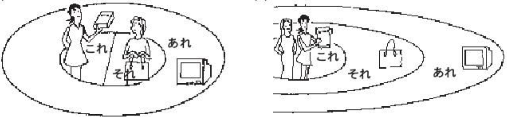

# 文章&语法
## 出迎え
李：JC企(き)画(かく)の　小野さんですか。  
小野：はい、小野です。李秀麗さんですか。  
李：はい、李秀麗です。初めまして。どうぞ　よろしく　お願(ねが)いします。  
小野：初めまして、小野緑(みどり)です。  
森：李さん、こんにちは。  
李：吉(よし)田(だ)さんですか。  
森：いいえ、私は　吉田じゃ　ありません。森です。  
李：あっ、森さんですか。どうも　すみません。  
森：いいえ。どうぞ　よろしく。  
李：李秀麗です。こちらこそ、よろしく　お願いします。  
## 家族の写真(しゃしん)
小野：李さん、それは　何ですか。  
李：これですか。家族の写真です。  
小野：この　方(かた)は　どなたですか。  
李：私の　母です。  
小野：お母(かあ)さんは　おいくつですか。  
李：52歳です。  
李：小野さん、それ、どうぞ。  
小野：えつ、何ですか。  
李：お土産です。  
小野：わあ、シルクの　ハンカチですか。  
李：ええ。スワトウの　ハンカチです。  
小野：どうも　ありがとう　ございます。
### 词汇
* これ　pron. 这个
* それ　pron. 那个
* あれ　pron. 那个  
***これ/それ/あれ为名词性物主代词,来代指某个已知的事物***  
对话人们处于同一空间时。 `これ`代指手上或手边的事物；`それ`代指有一定距离(触手可及); `あれ`代指需要距离较远通过移动才可触碰的事物。  
对话人处于不同空间时。`これ`代指讲话人邻域内的事务；`それ`代指听话人邻域内的事务；`あれ`代指超出双方邻域的事务。  
  
* この adj. 这个  
* その adj. 那个  
* あの adj. 那个  
この/その/あの使用时后需要加名词来组成主语或宾语。当后跟人是可使用`人(ひと)/方(かた、敬体)`　　
* どの adj.哪一个
* どれ pron.哪一个
どの，どれ用作疑问词用作三个以上的事物询问其中某一个事物时。  
### 语法
1. `名词/动名词/代词 + は 何ですか。`  
询问某个事物是什么。   
例：
* テレビは　何ですか。　电视机是什么？  
* これ/それ/あれは　何ですか。　这(手上)/这(手边)/那是什么？  
2. `だれ/どなたですか。`
询问某人是谁。
* どなた为敬体。
3. `何歳ですか。/おいくつえすか。`
询问年龄。
* おいくつ为敬体。
## ホテルの周辺
小野：ここは　コンビニです。隣(となり)は　喫茶店(きっさてん)です。  
李：あの　建物は　ホテルれすか。マンショですか。  
小野：あそこは　マンションです。  
李：あの　建物は　何ですか。  
小野：あそこも　マンションです。  
李：マンションの　隣は。
小野：マンションの　隣は　病院(びょういん)です。  
李：本屋は　どこですか。  
小野：そこです。　その　ビルの　２階(かい)です。  
李：あのう　東京の　地図は　どこですか。  
店員：地図ですか。　そちらです。  
李：いくらですか。  
店員：５００円です。
### 词汇
* ここ/そこ/あそこ pron.  这里/这里/那里  
* こちら/そちら/あちら/どちら　敬体  
代指地点用法同それ/これ/あれ，为名词性物主代词。
* 隣(となり)　n.附近  
* 建物 n.建筑  
* も 也  
* 病院(びょういん) n.医院  
* 本屋(ほにゃ)  n.书店
* ビル  n.建筑
* 階(かい)  n.层
* 地図(ちず)  n.地图
* いくら  多少(询问价钱)
### 语法
1. `名词+は　どこですか。`  
询问某个事物在哪里。
2. `名词+は　名词ですか，名词ですか。`  
疑问句，多种疑问条件。  
3. `名词+は　いくらですか。`  
询问某物多少钱。  
## 会社の場所
李：小野さん，会社は　どこに　ありますか。  
小野：ええと，ここです。  
李：近くに　えきが　ありますか。  
小野：ええ，JRと地下鉄の駅が　あります。JRの駅は　ここです。  
李：地下鉄の駅は　ここですね。  
小野：ええ，そうです。JRの駅の隣に　地下鉄の駅が　あります。  
小野さんの家は　どちらですか。  
小野：わたしの　家は　横浜です。  
李：ご家族も　横浜ですか。  
小野：いいえ，わたしは　一人暮らしです。  
李：ご両親は　どちらですか。  
小野：両親は　名古屋に　います。  
李：ご兄弟は？  
小野：大阪に　妹が　います。  
### 词汇
* 会社(かいしゃ) n.公司  
* 近く(ちかく)  n.附近  
* 駅(えき) n.站  
* 地下鉄(ちかてつ) n.地铁  
* 両親(りょしん) n.父母、两亲  
* 兄弟(きょうだい) n.兄弟  
* 妹(いもうと) 妹妹  
### 语法
1. `あります/います`　表示存在。  
あります表示不具有意志的事物。  
います表示具有意志的人或动物等。    
2. 场所+に　名词が　あります/います。  
某地有某物/人。  
例：
* 部屋に　机が　あります。  
* 公園に　子供が　います。
3. 名词は+场に　あります/います。  
某人或某物在某地。  
例：
* いすは　部屋に　あります。
* 吉田さｎは　庭に　います。  
4. ～は　どこですか　= は　どこに　ありますか/いますか。  
询问地点时可相互替换。  
5. 名词 と 名词
助词と表并列，与“和”意思相同。  
6. 上(うえ)/下(した)/前(まえ)/後(うし)ろ/なか/外  
表示具体位置时，需要用`名词 + の + 具体位置`。  
例：  
* 机の上に　猫が　います。
* 会社の隣に　花屋が　あります。
7. 疑问词 + も + 动词否定  
表示全面否定  
例：  
* 教室に　だれも　いません。  
* 冷蔵庫に　何も　ありません。
8. 一人暮(ぐ)らし
 一个人住，短语。  
9. ご両親/ご兄弟  
在称呼家族成员时，前面加上ご为敬语。  
## 遅刻
吉田：小野さん，李さんの　歓迎会は　いつですか。  
小野：あちっての　よるです。  
吉田：何時からですか。  
小野：六時からです。  
吉田：森君，おはよう。いま　何時ですか。  
森：十時十五分です。  
吉田：遅刻ですね。  
森：すみません，課長。今朝　九時に　起きました。  
森さんは　毎朝　何時に　起きますか。  
森：いつもは　七時ごろです。李さんは？  
李：わたしは　６時ごろです。  
森：北京支社は　何時に　始まりますか。  
李：八時です。午前　八時から　午後　五時まで　働きます。  
森：土曜日は？  
李：土曜日は　働きません。土曜日と日曜日は　休みです。  
### 词汇
* ～ごろ  
接在时间后边表示大致的时间范围，与中文左右意思相同。  
例：  
* 昨日　十二時半ごろ　寝ました。  
### 语法
1. 动词 + ます/ません
动词ます型的肯定与否定形式,可表示现在习惯性的动作、状态以及现在、将来时态。  
例：  
* 森さんは　毎日　働きます。  
* 田中さんは　明日　休みます。
2. 动词 + ました/ませんてした。  
动词ます型过去式的肯定与否定形式。  
例：  
* わたしは　昨日　働きました。
* 森さんは　今朝　８時に　起きませんてした。  
3. いつ　动词ますか。  
询问某动作或事物进行的时间，特意要询问具体时间时需要在表示时间的疑问词后加に。  
例：  
* 試験は　いつ　始まりですか。  
* 仕事は　何時に　終わりますか。  
表示持续性的动作或事态的起点或终点时需要使用`から`、`まで`。  
から表示某个事物的开始。  
例：  
* 展覧会は　いつから　始まりますか。  
まで表示某个事物的结束。  
例：  
* 仕事は　何時に　終わりますか。  
4. 名词(时间)から　名词(时间)まで　动词  
表示某个动作持续发生在某段时间内。  
例：  
わたしは　９時から　５時まで　働きます。  
森さんは　月曜日から　水曜日まで　休みました。  
## 交通機関(こうつうきかん)
吉田：李さん，昨日は　何時に　アパートへ　帰りましたか。  
李：ええと，たしか　十一時半ごろです。  
吉田：何で　帰りましたか。タクシーですか。  
李：電車です。渋谷(しぶや)まで　電車で　行きました。駅から　アパートまで　歩いて　帰りました。  
吉田：小野さんは？  
小野：わたしも　電車です。駅からは　タクシーで　家へ　帰りました。  
李：何時に　帰りましたか。  
小野：十二時ごろです。  
小野：森さん，昨夜　まっすぐ　帰りましたか。  
森：いいえ，課長と　一緒に　銀座へ　行きました。  
李：えつ，銀座(ぎんざ)ですか。  
小野：何時に　家へ　帰りましたか。  
森：夜中の２時です。  
李：２時ですか。それは　お疲れ様でした。  
### 词汇
* いえ、うち  
两者均为"家"的意思汉字也一样，いえ更侧重与建筑物，うち则更偏向家人家庭，与中文的家多意相同。  
* まっすぐ　帰ります。  
まっすぐ原为笔直的意思，在此处指直接回家为固定搭配。  
### 语法
* 场所 + へ +  动词  
动词为表示移动的动词时，へ前的场所表示目的地。  
* 场所から + 动词  
动词为表示移动的动词时，から前动词表示起点。  
* 场所から 场所まで　动词  
动词为表示移动的动词时，から前场所表示起点，まで前动词表示终点。  
* 交通工具で + 动词  
で前的交通工具名词表示交通手段，如果时步行的话用"歩(ある)いて"  
## 昼(ひる)ご飯
小野：李さん，これから　昼ご飯ですか。  
李：はい，小野さん　一緒に　行きます。  
小野：課長は？  
吉田：コンビニで　お弁(べん)当(とう)　とお茶を　買いました。  
李：いつも　コンビですか。  
吉田：いいえ。いつも　蕎(そ)麦(ば)屋で　蕎麦か　うどんを　たべます。  
李：そですか。  
小野：李さん，今日は　蕎麦屋へ　いきますか。   
李：じやあ，課長　失礼します。  
吉田：いってらっしゃい。    
店員：いらっしやいません。  
小野：すみません，親子丼を　ください。李さんは？  
李：わたしも　それを　ください。  
店員：かしこまりました。  
### 语法
1. 名词を + 动词  
名词加助词を组成动词的动作对象(宾语)  
例：  
* 李さんは　毎日　コーヒーを　飲みます。  
* わたしは　新聞を　読みません。  
2. 场所で + 动词  
场所名词加で后跟动词表示，动作发生的场所。  
例：  
* 李さんは　図書館で　勉強します。  
* わたしは　コンビニで　お弁当を　買いました。  
3. 名词 か 名词  
对若干名词中进行选择时，名词与名词中间加か，相当于汉语的"或"。  
例：  
* わたしは　毎朝　パンか　お粥(かゆ)を　食べます。
* 休みは　何曜日ですか。　―休みは　月曜日か火曜日です。
4. 名词を　ください  
表示想要获得某物。  
## スケジュール表
小野：さっき　長島さんに　電話を　もらいました。  
李：スケジュール表の　件ですか。  
小野：はい。  
李：もう　ファックスは　送りましょ。  
小野：いつですか。  
李：昨日の　夕方です。　もう　一度　送りますか。  
小野：ええ，お願いします。　わたしは　メールで　送ります。  
李：分(わ)かりました。  
小野：李さん，たった　今　長島さんに　メールを　もらいました。  
李：ファックスは　届(とど)きましたか。  
小野：ええ，フアックスも　メールも　届きましたよ。
李：そうですか。よかったです。  
小野：李さん，これ，どうぞ。箱(はこ)根(ね)の写真集(しゅう)です。前に　長島さんに　もらいました。  
李：ありがとう　ございます。  
### 词汇
* 前(まえ)に　adv.以前  
* も一度　adv.再一次  
* たった今 adv.刚刚  
* 教える　v.教  
* 借りる　v.借入  
* 貸す　v.借出  
* 習う　v.学习  
* 届く　v.收到,送到,寄到  
* 出す　v.寄送  
* 会う　v.见面  
* 作る　v.制造  
* あげる v.给  
* かける v.打(电话)  
### 语法
1. 名词(工具)で　动词  
で除了可表示交通工具外还可表示其他手段以及原材料。  
例：  
* 李さんは　日本語で　手紙を　書きます。
* 手紙を　速達で　送りました。
* 新聞紙で　紙飛行機を　作りました。
* 何で　うどんを　作りますか。  
2. 名1(人)は　名2(人)に　名3(物)を　あげます。  
某人给某人某物，名1给了名2名3。给予动作的发出者为名1后跟は,给予动作的接收者名2后跟に,传递的物品名3后跟を。  
例：  
* わたしは　小野さんに　お土産を　あげます。  
* 小野さんは　森さんに　チョコレートを　あげました。  
3. 名1(人)は　名2(人)に　名3(物)を　もらいます。  
某人从某人那儿得到某物，名1从名2那儿得到名3。  
例：
* わたしは　小野さんに　辞書を　もらいました。  
我从小野女士那儿得到了一本词典/小野女士给我了一本词典。  
* わたしは　長島さんから　写真を　もらいました。  
长岛先生给我了照片。から可被
* 森さんは　長島さんに　パンフレットを　もらいました。  
4. 名(人)に　会います。  
表示与人会见的时候使用会います,所见到的对象用に表示。  
* 李さんは　明日　長島さんに　会います。  
* わたしは　駅で　森さんに　会いました。  
## 温泉(おんせん)  
李：小野さん，この　浴衣(ゆかた)は　ちょっと　小さいです。  
小野：あら，それは　子供用ですよ。これを　どうぞ。  
李：これは　ちょうど　いいです。  
小野：李さん，熱く　ないですか。  
小野：いいえ，ちょうど　いいです。とても　気(き)持(も)ちが　いいですね。  
李：小野さん，素晴らしい　眺めですね。  
小野：ええ，本当に。  
李：小野さん，それは　何ですか。  
小野：ああ，これは　温泉の　お湯です。李さんも　飲みますか。  
李：ええ。あまり　おいしくないですね。  
### 语法  
1. 名は　一类形容词＋です。  
一类形容词是以い结尾的形容词。做谓语时要在后面加です。  
* 四川料理は　辛いです。  
* あの　スープは　　冷たいです。  
* この　お茶は　暑いです。  
2. 一类形容词做谓语的否定形式。  
一类形容词作谓语否定时将词尾的`い`变为`く`再加上`ないです`或`ありません`。  
* この　スープは　熱く　ないです。  
* 今日は　寒く　ないです。  
* この　本は　高く　ありません。  
3. 一类形容词作谓语过去式。  
一类形容词作谓语过去式时将此为的`い`变为`かった`再加上`です`。其过去形式的否定形式则是把词尾的`い`转变为`く　なかったです`或`く　ありませんでした`。  
例：  
* 旅行は　楽しかったです。  
* 昨日は　寒く　なかったです。  
* 昨日は　寒く　ありませんでした。  
在描述过去体验过的事物的性质时，日语必须使用过去形式。  
例：  
* 美味しいです。 好吃(正在吃的时候)。  
* 美味しかったです。　好吃(吃完以后)。  
`いいです`的过去式是`よかったです`，过去否定形式是`よく　ありませんでした。`  
4. 表示程度的副词  
日语中`とても`表示程度非常重的语气，其中`あまり`、`全然`后需要使用否定形式呼应。程度对比如下：
```
とても/大変(たいへん) > 少し(すこし)/ちょっと > あまり~ません > 全然~ません
```
5. 否定疑问句  
与汉语一样，是确认对方是否和自己持有相同看法的疑问句，但回答时与汉语不同，"はい"和"いいえ"都可以使用。  
例：  
`熱く　ないですか。`  
`ーはい，熱く　ないです。`  
`ーいいえ，熱く　ないです。`  
## 美術館
長島：昨日　京都(きょうと)は　行きました。  
小野：京都ですか。京都の紅葉(もみじ)は　どうでしたか。  
長島：とても　綺(き)麗(れい)でした。でも　町(まち)は　あまり　静(しず)かじゃ　ありませんでした。  
李：えつ？  
長島：今　ちょうど　修学旅行(しゅうがくりょこう)　シーズンです。　とても　にぎやかでした。  
李：この　通(とお)りは　静(しず)かですね。  
長島：ああ，今日は　平(へい)日(じつ)ですね。でも　休みの日は　観光客(かんこうきゃく)が　多(おお)いです。とても　にぎやかですよ。  
李：そうですか。  
李：あれえ，だれも　いませんね。  
小野：そうですね。  
李：ところで，この　美術館には　どんな　作品が　ありますか。  
小野：世界中の　有名な　作家の　彫(ちょう)刻(こく)です。  
長島：美術館の　庭にも　いろいろ　面白いのが　ありますよ。  
### 语法
1. 名词は　二类形容词です/でした。
二类形容词为不以い结尾的形同词。做谓语时要在后面加"です"。过去式是"でした"。  
例：  
* 京都の　紅葉は　有名です。
* この　まちは　にぎやかでした。  
2. 名词は 二类形同词です　ありません/では　ありませんでした。  
二类形容词的过去形式是"では　ありません"。过去否定形式为"では　ありませんでした"。在口语里"では"一般说为"じゃ"。  
例：  
* この　通りは　にぎやかでは　ありません。
* 昨日は　暇じゃ　ありませんでした。
3. 二类形容词な　名词  
二类形容词修饰名词时，需要在用二类形容词+な+名词。
## お土産
李：箱根は　ホテルや旅館が　多いですね。  
小野：そうですね。会社の　別荘も　たくさん　あります。  
李：長島さんや　小野さん　よく　来ますか。  
長島：ええ，車で　時々　きます。  
小野：わたしは　運転が　できませんから，いつも　電車です。  
長島：ぼくは　来月　また　来ますよ。  
李：どうしてですか。  
長島：この　近くの　ホテルで　友達の　写真展が　ありますから。  
李：箱根の　お土産は　何が　いいですか。  
小野：うーん，そうですね．．．，迷いですね。  
長島：寄木細工は　いかがですか。とても　有名ですよ。  
李：きれいな　模様ですね。  
小野：ええ。  
長島：気に　入りましたか。  
李：はい，とても。  
### 词汇
* 分かる 懂  
* できる 会  
* 時々(ときどぃ) 有时  
* ロック 摇滚  
* ポップス 流行乐  
* など 等等  
* よく 有时  
* たまに 偶尔  
### 语法
1. 名词1は 名词2が 一类形容词/二类形容词です。  
"好きです"、"嫌いです"、"怖いです"等表达感情类的形容词可以使用次句型。名词1为表示感情的主体，名词2为表示情感的对象。  
例：  
* 小野さんは　歌が　すきです。  
* 王さんは　にくが　嫌いです。  
* 林さんは　犬が　怖いです。  
2. 名词1は 名词2が 分かります/できます。  
"分かります"　"できます"　"上(じょう)手(ず)です"　"下(へ)手(た)です"　"苦(にが)手(て)です"等有关能力的词语也可使用此句型。
* スミスさんは　韓国語が　分かります。  
* わたしは　コンピュータが　できません。  
* 小野さんは　料理が　上手です。  
3. 名词や　名词  
助词や用于列举许多项目中的两项，助词と用于列举所有的的项目。两者都为连接词。  
例：  
吉田さんは　時々　中国や　韓国へ　いきます。
森さんは　サッカーや　野球が　すきです。
わたしは　お店で　野菜や　果物などを　買いました。
4. "~から"和"だから"  
"から"为复句中表示原因的助词，位于陈述原因、理由的小句句尾。通常说明原因、理由之后再陈述结论，但有时也会先陈述结论再说明原因。无论哪种情况，"から"都必须接在表示原因、理由的小句句尾。  
例：  
* 森さんは　お酒が　すきですから。毎日　飲みます。  
* 寒いですから。窓を　閉めます。  
* 窓を　しめます。寒いですから。  
"だから"表示原因、理由的句子的连词，相当于汉语的"所以"，较为礼貌的说法时"ですから"。"だから/ですから"为连词可单独使用在结果的句子前面。
例：  
* キムさんは　野菜が　嫌いです。だから，あまり　野菜を　食べません。  
* 明日は　休みです。ですから，子供用と　動物園へ　いきます。  
5. 场所で　事が　あります。  
某事发生在某个场所。与`场所に　物が　あります不同此处表示的是某事发生在某地，而非某物在某地。  
例：  
* 来週，金曜日の　夜　七時から，ホテルで　パーティーが　あります。
6. いかがですか。
向对方提出建议或者向对方推荐某物时，使用"~は　いかがですか/どうですか。"，拒绝时使用"今は　結構です。"等较为委婉的表达。  
例：  
* コーヒーは　いかがですか。―今は　結構です。
7. 気に　入りました。
仅用于第一次见到某事物时表示感到中意，其对象用"が"表示。仅仅能用于熟人和朋友不能对长辈使用。  
例：  
* 気に　入りました。　―はい、とでも。  
* この　赤い　かばんが　気に　入りましたから，これを　買いました。  
## お酒とお茶  
李：長島さんは　よく　お酒を　飲みますか。  
長島：ええ。お酒は　大好きですから，毎晩　飲みますよ。  
李：ビールと　日本酒と，どちらが　好きですか。  
長島：どちらも　好きです。でも　焼酎が　一番好好きです。  
小野：焼酎は　最近　人気が　ありますね。  
李：小野さんも　焼酎(しょうちゅう)が　好きだすか。  
小野：いいえ，わたしは　焼酎より　ワインの　ほうが　いいです。でも，ビールも　よく　飲みますよ。  
長島：中国は　お茶の　種類(しゅるい)が　多いですね。  
李：ええ。ウーロン茶，ジャスミン茶，緑茶など，なくさん　あります。  
小野：どの　お茶が　一番　人気が　ありますか。  
李：やっぱり　ウーロン茶です。  
小野：李さんも　よく　飲みますか。  
李：ええ。毎日　ウーロン茶か　ジャスミン茶を　飲みます。  
長島：どちらが　美味しいですか。  
李：どちらも　美味しいですよ。わたしは　ジャスミン茶の　ほうが　好きです。　　
### 词汇  
* やっぱり  
やっぱり是"やはり"较为随便的说法，用于日常谈话。表示某信息或事态的发展与自己预测一致，意思是正如自己所料。  
### 语法  
1. 名词1は　名词2より　一类形容词/二类形容词です。  
比较名词1和名词2，名词1比名词2更具有形容词所表示的性质时使用这个句型。程度的差异较大时使用副词"ずっと"  
* 李さんは　森さんより　若いです。  
* 中国は　日本より　ずっと　広いです。  
* 上海は　北京より　にぎやかですか。  
2. 名词1は 名词2の　ほうが　一类形容词/二类形容词です。  
比较名词1和名词2，名词2比名词1更具有形容词所表示的性质时使用这个句型。  
* 日本より　中国のほうが　広いです。(与日本相比，中国更辽阔)  
* 大阪より　東京のほうが　にぎやかですか。  
3. 名词1は 名词2ほど 一类形容词く　ないです/二类形容词では　ありません。  
比较名词1和名词2，名词1比名词2更不具有形容词的性质时使用该句型。句尾必须用否定形式。  
例：  
* わたしの　部屋は　王さんの部屋ほど　綺麗では　ありません。  
* 東京の冬は　北京の冬ほど　寒く　ないです。  
4. 名词1の中で　名词2が　一番　一类形容词/二类形容词です。  
在某个范围内名词2最具有形容词所表示的性质时使用这个句型。"名词1"为"名词2"的所属范围。  
例：  
* スピードの中で　サッカーが　一番面白いです。  
* 日本料理の中で　寿司が　一番美味しいです。  
如名词1表示时间或场所，则后边不加"の中"。"一番"与汉语"最"意思相同但是日语中使用时必须表示一个明确的范围或比较对象这种情况。  
例：  
* 日本で　一番高い山は　富士山です。    
* 一年で　一番寒い月は　二月です。  
5. 名词1と 名词2と どちらが 一类形容词/二类形容词ですか。  
询问两种事物当中哪一种更具有形容词的性质时使用此句型。"どちら"是二者选一时使用的疑问词。  
例：  
* 日本語と英語と　どちらが　難しですか。 ―日本語のほうが　難しいです。  
* コーヒーと　紅茶と　とっちが　好きですか。　―どても　好きです。  
6. どの名词　いつ/どれ/だれ/何が　一番　一类形/二类形ですか。  
询问三个以上事物当中哪一个更具有形容词的性质时，根据所询问的对象不同选取不通的疑问词。名词人和时间较为特殊，名词为人时必须使用だれ，名词为时间时必须使用いつ。其他形容物的名词使用具体的疑问词，但是事物不存在于上下文环境或眼前的时候需要用"何が"。
## 单元末阅读文 李さんの手紙
小野さん  
&emsp;わたしは 今　京都にいます。おととい　新幹線で　来ました。  
&emsp;京都は　今　紅葉はとても綺麗です。京都の紅葉は　本当に素晴らしいですね。わたしは　日本の季節の中で，秋が　一番好きです。小野さんは　どうですか。  
&emsp;京都には　お寺や神社が　たくさんありますね。おとといは，金閣寺や八坂神社など，いろいろな　所へ行きました。天気が　よかったですから，観光客が　たくさんいました。どこも　とても　にぎやかでした。  
&emsp;昨日は,奈良へ　行きました。奈良も　お寺が　多いですね。でも，京都より　静かでした。昨日は　雨でしたから，観光客が　あまり　いませんでした。東大寺で　大仏を見ました。本当に　大きかったです。びっくりしました。  
&emsp;小野さんは，京都と　奈良と　どちらが　好きですか。  
&emsp;小野さんに　お土産を　買いました。とても　きれいな紅葉の絵葉書です。  
&emsp;明日の夜帰ります。  
&emsp;では，また。  
<div align="right">１１月２５日</div>
<div align="right">李秀麓</div>

## 居酒屋
小野：これから　森さんと　近くのお店へ　飲みに　行きます。李さんも　一緒に　どうですか。  
李：えつ，いいですか。お願いします。  
李：森さんたちは　この店へ　よくきますか。  
森：ええ，ぼくは　週に　二回ぐらい　きます。  
小野：わたしも　よく　来ます。  
森：あのう，すみません。とりあえず　生ビールを　３つ　おねがいします。  
李：生ビールが　１杯３００円ですか。  
森：ここは　お酒も　食べ物も　安いです。焼き鳥は　５本で　４００円ですからね。  
小野：唐揚げや　肉じゃがは　１皿３５０円です。  
李：ほかのお店は　いくらぐらいですか。  
森：生ビールは　だいたい　１杯４００円か　４５０円ですね。  
小野：焼き鳥は　1本１５０円ぐらいですよ。  
李：じゃあ，ここは　安いですね。  
### 词汇
* 量词  

|量词|使用对象|量词|使用对象|
|:-:|:-:|:-:|:-:|
|~人(にん)|人|~本(ほん)|瓶、铅笔、伞、香蕉等细长物品|
|~台|机械或车辆：车、机动车、电脑等|~つ|立体物品：橘子、帽子等。抽象的事物：年龄、迷、选项等。`只能形容<10的数字`|
|~枚|薄平物品：纸、盘子、邮票、衬衫等|~杯|容器内的饮料：茶、咖啡、啤酒等|
|~冊|书、笔记本等|~匹|小动物：🐕、🐈、🐟、🐛等|
|~歳|年龄|~頭|大动物：🐂、🐎、🐘等|
|~回|次数|~羽|🦅、🐇等｜
|~着|衣服等|~番|顺序｜
|~個|立体的物品：鸡蛋、饭团、球等。空容器或器皿：箱子、盒子、空罐子、玻璃杯等。概念性、抽象性事物：密码等|~足|成对的物品：鞋子、袜子等｜

* 数词与量词  

||~つ|~人|~台|~本|~杯|
|:-:|:-:|:-:|:-:|:-:|:-:|
|1|ひとつ|ひとり|いちだい|いっぽん|いっばい|
|2|ふたつ|ふたり|にだい|にほん|にはい|
|3|みっつ|さんにん|さんだい|さんばん|さんばい|
|4|よっつ|よにん|よんだい|よんほん|よんはい|
|5|いつつ|ごにん|ごだい|ごほん|ごはい|
|6|むっつ|ろくにん|ろくだい|6ぽん|ろばい|
|7|ななつ|ななにん|ななだい|ななほん|ななはい|
|8|やっつ|はちにん|はちだい|はっぽん|はっばい|
|9|ここのつ|きゅうにん|きゅうだい|きゅうほん|きゅうはい|
|10|とう|じゅうにん|じゅうだい|じゅっほん|じゅっばい|
|何|いくつ|なんにん|なんだい|なんぽん|なんばい|
### 语法
1. 时间段+动词  
表示某个动作在一段时间内持续发生。  
例:  
* 李さんは　毎日　7時間　働きます。  
* 昼　1時間　休みます。
* 森さんは　9時間　寝ます。
2. 时间名词に 名词次数+动词  
表示一段时间内进行若干次动作。  
例:  
* 李さんは　1週間に　2回　ペールへ　行きます。  
* この花は　二年に　一度　咲(さ)きます。
3. 名词(场所)へ+动词に　行きます/来ます。  
表示移动行为目的时使用(去某地做某事)。表示移动行为的目的时动词使用ます形但要去掉ます。
例：  
* 午後　郵便局へ　荷物を　出しに　行きます。  
* 小野さんは　ブールへ　泳ぎに　行きます。  
* 李さんは　私の家へ　遊びに　来ます。  
4. 名词(数量)+で  
用于不称重量而以个数的方式抛售。  
* この　ケーキは　三個で　５００円です。  
* この　ケーキは　一個で　２００円です。  