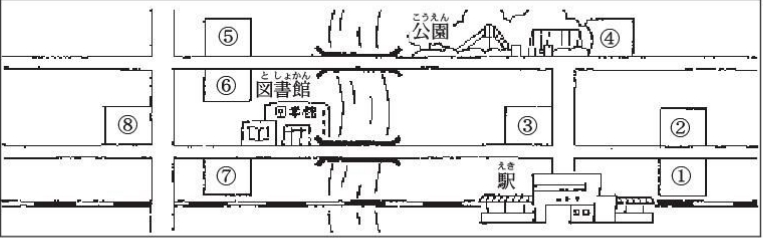

# 练习下
## 北京市街へ
### 练习1
1. 仿照例句替换画线部分  
*例1: 李さんにあげます/本 → これは李さんにあげる本です。*  
**(1) 課長に見せます/手紙**  
これは課長に見せる手紙です。  
**(2)図書館で借りました/雑誌**  
これは図書館で借りる雑誌です。  
**(3)1日に3回飲みます/薬**  
これは1日に3回飲む薬だ。  
**(4)甘くておいしです/飲み物**  
これは甘くて美味しい飲み物です。  
**(5)日本にはありません/果物**  
これは日本にはない果物です。  
**(6)きれいで優しかったです/母の写真。**  
これはきれいで優しかった母の写真です。  
*例2:子供/読みます/絵本 → これは子供が読む絵本です。*  
**(7)森さん/カラオケでよく歌います/中国の歌**  
これは森さんがカラオケでよく歌う中国の歌です。  
**(8)わたし/生まれました/家の写真**  
これはわたしが生まれる家の写真です。  
**(9)陳さん/まだ食べだことがありません/日本料理です。**  
これは陳さんがまだ食べたことがなかった日本料理です。  
**(10)李さん/明日の会議で使います/資料**  
これは李さんが明日会議で使う資料です。  
*例3:昨日会社を休みました。/昨日会社を休んだ人は森さんです。*  
**(11)明日会社へ来ません。**  
明日会社へこない人は森さんです。  
**(12)山でけがをしました。**  
山で怪我をした人は森さんです。  
**(13)まだ結婚していません。**  
まだ結婚していない人は森さんです。  
**(14)周さんを知りませんでした。**  
周さんを知らなかった人は森さんです。  
2. 仿照例句替换画线部分  
テレビを見ます/タバコを吸います/電話をかけます  
新聞を読みます/お茶を飲みます/手紙を書きます  
*例:<u>テレビを見て</u>いる人はだれですか。*  
(1)タバコを吸っている人はだれですか。  
(2)電話をかけている人はだれですか。  
(3)新聞を読んでいる人はだれですか。  
(4)お茶を飲んでいる人はだれですか。  
(5)手紙を書いている人はだれですか。  
3. 仿照例句连接句子  
*例1:中国で買いました/CDを友達に貸しました → 中国で買ったCDを友達に貸しました*  
**(1)李さんが書きました/レポートを読みました**  
李さんが書いたレポートを読みました  
**(2)日本で撮りました/ビデオを見ませんか**  
日本で撮ったビデオを見ませんか  
**(3)明日会社泊まります/ホテルの電話番号を教えてください**  
明日会社泊まってホテルの電話番号を教えてください  
**(4)父にもらいました/時計をなくしました。**  
父にもらった時計をなくしました  
*例2:操作が簡単です/パソコンが欲しいです → 操作が簡単なパソコンが欲しいです。*  
**(5)デザインが新しいです/靴を買いたいです**  
デザインが新しい靴を買いたいです。  
**(6)自然が豊かです/国が少なくなりました**  
自然が豊か国が少なくなりました。  
**(7)あなたの子供が好きです/料理は何ですか**  
あなたの子供好き料理は何ですか。  
**(8)仕事が面白くて,給料が高いです/会社に入りたいです**  
仕事が面白くて，給料が高い会社に入りたいです。  
### 练习2
1. 选择适当的回答填入  
(1) エレベーターの前にいる人はだれですか。  
いいえ，だれでしょうね。  
(2) あなたが買いたいかばんはどですか。  
あのち小さくて赤いのです。  
(3)フランス語ができる人はだれですか。    
田中さんだと思います。  
(4)机の上にあるパソコンを使ってもいいですか。  
すみません,ちょっと…。  
2. 选择适当词语填入  
(1)小野さんが中国へ行く日はいつですか。―あさってです。  
(2)それはどこで撮った写真ですか。―北京です。  
(3)昨日聞いたCDはどうでしたか。―よかったですよ。  
(4)あなたが生まれた町はどんな所ですか。―静かな所です。  
(5)今年JC企画に入った人の名前は何と言いますか。―山田さんです。  
3. 翻译  
(1)これは明日の会議で使う資料です
。  
(2)中国で買ったCDを友達に貸しました。  
(3)操作が簡単なパソコンを欲しいです。  
## 握手とお辞儀
### 练习1
1. 替换画线部分练习  
*例1:自転車に2人で乗ります/危ないです → <u>自転車に2人で乗る</u>のは<u>危ないです</u>。*  
**(1)友達と話します/楽しいです。**  
友達と話すのは楽しいです。  
**(2)町を歩きます/面白いです。**  
町を歩くのは面白いです。  
**(3)朝早く走ります/気持ちがいいです**  
朝早く走るのは気持ちがいいです。  
**(4)家族で旅行します/楽しいです**  
家族で旅行するのは楽しいです。  
*例2:色鉛筆ですスケッチします/すきです → 加藤さんは色鉛筆でスケッチするのが好きです。*  
**(5)泳ぎます/下手です**  
泳ぐのが下手です。
**(6)歌を歌います/上手です**    
歌を歌うのが上手です  
**(7)歩きます/嫌いです**  
歩くのが嫌いです。  
**(8)外国の映画を見ます/好きです**  
外国の映画を見るのが好きです。  
*例3:吉田さんが転勤しました。 → 吉田さんが転勤したのを知っていますか。*  
**(9)明日試験があります。**  
明日試験があるのを知っていますか。  
**(10)駅前に新しいスーパーできます。**  
駅前に新しいスーパーでくるの知っていますか。  
**(11)北京タイガースが優勝しました。**  
北京タイガースが優勝したのを知っていますか。  
**(12)水曜日は映画の料金が半額にあります。**  
水曜日は映画の料金が半額にあるのを知っていますか。  
2. 仿照例句替换画线部分进行练习  
*例:今日来ます/誰 →　<u>今日来る</u>のは<u>誰</u>ですか。*  
**(1)李さんが描きました/どの絵**  
李さんが描くのはどの絵ですか。  
**(2)ここに箱を置きました/誰**  
ここに箱を置いたのは誰ですか。  
**(3)その服を買いました/どこ**  
その服を買ったのはどこですか。  
**(4)最近森さんに会いました/いつ**  
最近森さんに会ったのはいつですか。
3. 仿照例句替换画线部分  
*例:李さん，なかなか来ませんね/李さんに言います*  
&emsp;*李さん，なかなかきませんね。*  
&emsp;*あっ，いけない。李さんに言うのを忘れました。*  
&emsp;*えっ，また忘れたんですか。*  
&emsp;*どうもすみません。*  
**(1)来週のコンサート，楽しみですね/チケットを注文します**  
来週のコンサート，楽しみですね。  
あっ,いけない。チケットを注文するのを忘れました。  
**(2)会費を払ってください/お金を下ろします**  
会費をからってください。  
あっ，いけない。お金を下ろすのを忘れました。  
**(3)宿題を出しましたか/します**  
宿題を出しましたか。  
あっ，いけない。するのを忘れました。  
**(4)昼ご飯を食べませんか/お弁当を買います**  
昼ご飯を食べませんか。  
お弁当を買うのを忘れました。  
4. 仿照例句替换画线部分  
*例1:大雨です →　明日は大雨でしょう。*  
**(1)暖かいです**
明日は暖かいでしょう。  
**(2)風が吹きます。**  
明日は風が吹くでしょう。  
**(3)雪が降りません。**  
明日は雪が降らないでしょう。  
**(4)暇です。**  
明日は暇でしょう。  
**(5)森さんは会社に行きません。**  
明日は森さんは会社に行かないでしょう。  
*例2:*   
&emsp;*甲:李さんは料理が上手ですですか。*   
&emsp;*乙:料理の本をよく読んでいるから，たぶん上手でしょう。*  
**(6)明日は試験ですね。葉子さんは合格しますか。**  
毎日6時間勉強しているから，たぶん合格でしょう。  
**(7)明日は晴れますか。**  
月がきれいですから，たぶん晴れでしょう。  
**(8)李さんはポーティーにきますか。**  
昨日約束したから，たぶんきるでしょう。  
5. 仿照例句替换画线部分  
*例来ません → 李さんは来ないかもしれません。*  
**(1)休みます**  
李さんは休まないかもしれません。  
**(2)買いません**  
李さんは買あないかもしれません。  
**(3)忙しいです**  
李さんは忙しいかもしれません。  
**(4)暇です**  
李さんは暇るかもしれません。  
**(5)病気です**  
李さんは病気するかもしれません。  
**(6)行きません**  
*例:李さんは行くないかもしれません。*  
*あの売り場に人がたくさんいますね。*  
*そうですね。バーゲンかもしれません。*  
**(7)隣のうちはにぎやかですね。**  
そうですね。パーティーかもしれません。  
**(8)事務所に誰もいませんね。**  
そうですね。昼休むかもしれません。  
**(9)どれも高いですね。**  
お金が足りらないかもしれません。  
### 练习2
1. 词语变为适当形式
(1)テレビを消すのが好きです。  
(2)友達と遊ぶのは楽しいです。  
(3)天気が悪いから，行くのをやめました。  
(4)森さんは走るのが速いです。  
(5)今食べたのは何ですか。  
2. 词语变为适当形式  
(1)王さんは今週忙しいから，たぶん来ないでしょう。  
(2)李さんはカラオケが嫌いかもしれません。  
(3)李さんはたぶん合格するでしょう。  
(4)人がたくさんいますから，部屋の中は暑いかもしれません。  
(5)森さんはまだ会社にいるかもしれません。  
3. 翻译  
(1)李さんは絵をかくのが好きです。  
(2)手紙を送るのを忘れました。  
(3)今日森さんは会社に行かないかもしれません。  
## 朝の公園
### 练习1
1. 替换画线部分  
*例:子供です/横浜に住んでいました。 → <u>子供</u>の時，<u>横浜に住んでいました</u>。*  
**(1)病気です/1か月会社を休みました**  
病気の時，1か月会社を休みました。  
**(2)休みです/子供とサッカーをします**  
休む時，子供とサッカーをします。  
**(3)信号が青です/道を渡ってもいいです**  
信号が青の時，道を渡ってもいいです。  
**(4)信号が赤です/道を渡っていけません**  
信号がが赤の時，道を渡っていけません。  
**(5)海外旅行です/パスポートが要ります**  
海外旅行の時，パスポートが要ります。  
2. 替换画线部分  
*例: 天気がいいです/友達と野球をします → 天気がいい時，友達と野球をします。*  
**(1)寂しいです/明るい曲を聞きます**  
寂しい時，明るい曲を聞きます。  
**(2)夜静かです/詩を書きます**  
夜静かな時，詩を書きます。  
**(3)困りました/わたしに相談してください。**  
困った時，わたしに相談してください。  
**(4)紙を切ります/はさみを使います**  
紙を切る時，はさみを使います。  
**(5)部屋を使いません/電気を消してください**  
部屋を使あない時，電気を消してください。  
**(6)お金がありません/どうしますか**  
お金がない時，どうしますか。  
**(7)都合が悪いです/すぐ連絡してください**  
都合が悪い時，すぐ連絡してください。  
**(8)朝友達に会いました/「おはよう」と言います**  
朝友達に会った時，「おはよう」と言います。  
3. 替换画线部分  
*例1:雑誌を読みます/ご飯を食べます*  
*李さんは何をしていますか。*  
*雑誌を読みながら，ご飯を食べています。*  
**(1)ラジオを聞きます/食事の準備をします**  
李さんは何をしていますか。  
ラジオを聞くながら，食事の準備をしています。  
**(2)長島さんと話します/写真を選びます**  
李さんは何をしていますか。  
長島さんと話すながら，写真を選んでいます。  　　
**(3)手をたたきます/歌ったり踊ったりします**  
手をたたくながら歌ったり踊ったりします。  
**(4)部屋の中を歩きます/スピーチの練習をします**  
部屋の中を歩くながら，スピーチの練習します。  
*例2:野球が好きです/ええ，大好きです*　　
*森さん，野球が大好きでしょう？*  
*ええ，大好きです。*  
**(6)明日から出張です/はい，1週間の予定です**  
森さん，明日から出張でしょう?  
はい，1週間の予定です。  
**(7)ここにカメラがありました/さあ，気がつきませんでしたが…**  
ここにカメラがあったでしょう?  
さあ，気が付きませんでしたが…  
**(8)日本の恋人がいます/えっ! いいえ，いません**  
日本の恋人がいるでしょう?  
えっ! いいえ，いません。  
**(9)スキーができます/ええ。でも，上手ではありません**  
スキーができるでしょう?  
ええ。でも，上手ではありません。  
**(10)スペイン語は難しいです/いいえ，そんなに難しくないですよ**  
スペイン語は難しいですよう?  
いいえ，そんなに難しくないですよ。  
4. 替换画线部分  
*例姉は銀行で働きます → 姉は銀行で働きています*  
**(1)父は市役所で働きます**  
父は市役所で働きています  
**(2)兄は大学で国際関係学を勉強します**  
兄は大学で国際関係学を勉強しています。  
**(3)母は毎日病院に通います**  
母は毎日病院に通っています。  
**(4)駅前のスーパーは安い品物を売ります**  
駅前のスーパーは安い品物を売っています。  
**(5)わたしは毎日運動します**  
わたしは毎日運動しています。  
**(6)弟の会社はパソコンの部品を作ります**  
弟の会社はパソコンの部品を作っています。  
### 练习2
1. 造句  
*例:テレビを見ながら晩ご飯を食べています。*  
(1)タバコを吸うながら，テレビを見ています。  
(2)歌を歌うながら，公園に散歩しています。  
(3)お茶を飲むながら，音楽を聞いています。  
(4)笑うながら，アルバムを見ています。  
2. 根据描述选词  
例:ご飯を食べる時に使うものです。ーはし  
(1)紙を切る時に使う道具です。ーはさみ  
(2)買い物する時に使う物です。ークレジットカード  
(3)話したりメールを送ったりする時に使う物です。ー携帯電話  
(4)ご飯を食べる時に行く所です。ー食堂  
(5)切手を買ったり荷物を送ったりする時に行く所です。ー郵便局  
3. 词语适当形式  
(1)あそこで電話をかけている人は誰ですか。  
(2)あなたが好きな音楽は何ですか。  
(3)吉田さんは昨日来なかったいでしょう。  
(4)李さんは歌を歌いながら，掃除しています。  
(5)あの店は日曜日は休みかもしれません。  
4. 翻译  
(1)子供の時，大きな地震ありました。  
(2)李さんはテレビを見るながら，ご飯を食べています。  
(3)森さん，昨日駅前の喫茶店にいたでしょう。  
## 28课森さんの新居  
### 练习1
1. 替换画线部分  
*例1:馬さん/地図 → <u>馬さん</u>はわたしに<u>地図</u>くれました。*  
(1)姉/ネックレス  
姉はわたしにネックレスをくれました。  
(2)李さん/薬  
李さんはわたしに薬をくれました。  
(3)兄/パソコン  
兄はわたしにパソコンをくれました。  
(4)友達/中国のお土産  
友達はわたしに中国のお土産をくれました。  
*例2:北京を案内します → 森さんは李さんに北京を案内してもらいます。*  
(5)有名なレストランを紹介します  
森さんは李さんに有名なレストランを紹介してもらいました。  
(6)食事をごちそうします。  
森さんは李さんに食事をごちそうしてもらいました。  
(7)家族の写真を見せます  
家族の写真を見せてもらいました。  
(8)切符の買い方をおしえます  
切符の買い方を教えてもらいました。  
*例3:森さん/デジカメ/貸します → わたしは森さんにデジカメを貸してあげました*  
(9)王さん/自転車/貸します  
わたしは王さんに自転車を貸してあげました。  
(10)キムさん/英語/教えます  
わたしはキムさんに英語を教えてあげました。  
(11)田村さん/仕事/紹介します  
わたしは田村さんに仕事を紹介してあげました。  
(12)李さん/パソコン/貸します  
わたしは李さんにパソコンを貸してあげました。  
*例４:美味しいお茶/送ります → 小野さんが美味しいお茶を送ってくれました。*  
(13)新鮮な野菜/送ります  
小野さんが新鮮な野菜を送ってくれました。  
(14)旅行のお土産/届けます  
小野さんが旅行のお土産を届けてくれました。  
(15)日本語/教えます  
小野さんが日本語を教えてくれました。  
(16)仕事/遅くまで手伝います  
小野さんが仕事を遅くまで手伝ってくれました。  
2. 仿照例句回答提问  
*例:*  
*その本,誰がくれましたか。―李さんがくれました。*  
*その本,誰にもらいましたか。―李さんにもらいました。*  
*李さんは誰に上げましたか。―わたしにくれました。*  
(1) その地図，誰が見せてくれましたか。  
―李さんがくれました。  
(2) その本，誰にもらいましたか。  
―李さんにもらいました。  
(3) 李さんは地図を誰に見せてあげましたか。  
―わたしにあげました。  
(4)森さんは自転車  
―李さんに貸してもらいました。  
(5)陳さんは自転車を誰に貸してあげましたか。  
―李さんに貸してあげました。  
3. 替换划线句子  
*例:*  
*天ぷらの作り方/教えます/うまくできません*  
*→ 天ぷらの作り方を教えてもらいましたが，うまくできません。*  
(1) コンピュータの部品/交換します/うまく動きません。  
コンピュータの部品を交換してもらいましたが，うまく動きません。  
(2) 中田さんの住所/調べます/分かりませんでした。  
中田さんの住所を調べてもらいましたが，わかりませんでした。  
(3) 日本語の発音/直します/まだうまくできません。  
日本語の発音を直してもらいましたが，まだうまくできません。  
(4) 大使館の番号/教えます/書いたメモをなくしました。  
大使館の番号を教えてもらいましたが，書きたメモをなくしました。  
### 练习2
1. 选择正确的答案  
*例: 戴さんがわたしを空港まで送ってくれました。*  
(1)父にパソコンの雑誌を買ってあげました。  
(2)友達が引っ越しを手伝ってくれるから，大丈夫です。  
(3)わたしは森さんに荷物を持ってもらいました。  
(4)わたしに来た中国語の手紙を，李さんが訳してくれました。  
(5)わたしは小野さんに東京を案内してもらいました。  
(6)分からないんですか。じゃあ，教えてあげましょう。  
2. 选取适当的词  
*例: あの店の料理はなかなか美味しかったでえすよ*  
(1)もしかしたら王さんは行かないかもしれません。  
(2)あの人は英語とフランス語が上手です。それに韓国語もできます。  
(3)時間がありませんから，すぐに来てください。
(4)朝はパンですか，ご飯ですか。―ほとんどご飯です。    
(5)明日の朝，横浜へ行かなければなりません。それで，すみませんかが，会社へ行くのが少し遅れます。  
(6)そう言えば，明日は九月一日，僕の誕生日だ。  
3. 翻译  
(1)馬さんに地図をくれました。  
(2)森さんは李さんが北京を案内してらいました。  
(3)明日，森さん引っ越しますか。―皆で手伝ってあげましょう。  
## 29课练习
### 练习1
1. 练习动词命令形  
*[例] 電気を消します → 電気を消せ → 電気を消しなさい*  
&emsp;&emsp;*タバコを吸いません → タバコを吸うな。*  
(1)もっと急ぎます  
もっと急げ → もっと急ぎなさい  
(2)免許証を見せます  
免許証を見せろ → 免許証を見せなさい  
(3)謝ります  
謝れ → 謝りなさい  
(4)仕事をします  
仕事をしろ → 仕事をしなさい  
(5)すぐに来ます  
すぐに来い → すぐに来なさい  
(6)言葉を覚えます  
言葉を覚えろ → 言葉を覚えなさい  
(7)静かにします  
静かにしろ → 静かにしなさい  
(8)スビートを出しません  
スビートを出すな  
(9)ここに来ません  
ここに来るな
(10)人に迷惑をかけません  
人に迷惑をかけるな  
(11)戦争をしません  
戦争をするな  
(12)授業をサボりません  
授業をサボるな  
(13)約束を破りません  
約束を破るな  
(14)慌てません  
慌てるな  
2. 画线部分进行练习  
(1)写真を撮りません  
あれは「写真を撮るな」と言う意味です。  
(2)まっすぐ行きます  
あれは「まっすぐ行く」と言う意味です。  
(3)車を止めません  
あれは「車を止めるな」と言う意味です。  
(4)ここで止まります  
あれは「ここで止まる」と言う意味です。  
3. 仿照例句替换画线部分  
*[例] もう十一時です/早く寝ます → もう十一時だから，早く寝なさい*  
(1)もう十時です/早く起きます  
もう十時だから，早く起きなさい  
(2)ご飯です/手を洗います  
ご飯だから，てを洗いなさい  
(3)汚いです/テーブルの上を片づけます  
汚いだから，テーブルの上を片付けなさい  
(4)体にいいです/野菜をたくさん食べます  
体にいいだから，野菜をたくさん食べなさい  
(5)風邪を引きます/早く服を来ます  
風邪を引きだから，早く服を来なさい  
### 练习2  
1. 选词填空  
*[例] 子供は遊ぶのが好きです → お母さんはもっと勉強しなさいと言いました。*  
(1)子供たちが大きい声で話ています → お母さんはもっと静かにしなさいと言いました。  
(2)サッカーの練習をしています。 → 先生は頑張りなさいと言いました。  
(3)森さんが説明していますが，よくわかりません。 → 課長はゆっくり話しなさいと言いました。  
2. 选词变为适当形式填空  
*[例] 課長は遅刻するな，早くレポートを出せと言いました。*  
(1)警官はスピードを  
(2)信号の赤は止まると言う意味です。  
(4)父はよく勉強しろ，そしてよく遊べと言いました。  
4. 翻译  
(1)先，部長は何と言いましたか。―レポートを早く出せと言いました。 
(2)このマークは「タバコを吸うな」と言う意味です。  
(3)お風呂に早く行きなさい。
## 30课练习  
### 练习1
1. 仿照例句，将词语变为意志形
*[例]もう十一時だから寝よう。*  
(1)疲れだね。ちょっと休もう。  
(2)安くなったから，この靴を買おう。  
(3)この時計，気に入っているから，直して使おう。  
(4)みんなそろったから，会議を始めよう。  
2. 仿照例句替换画线部分  
*[例1] 帰ります → そろそろ帰ろうと思います。*  
(1)寝ます → そろそろ寝ようと思います  
(2)結婚します → そろそろ結婚しょう  
(3)出発します → そろそろ出発しよう  
(4)片付けます → 片付けよう  
*[例2] 今度，長江下りをします。 → 今度，長江下りをしようと思っています。*  
(5)来年は北海道にいきます。 → 来年は北海道に行こうと思っています。  
(6)これは大切なので，もう一度彼に言います。 → これは大切なので，もう一度彼に言おう  
(7)ここは不便なので，引っ越します。 → ここは不便なので，引っ越しよう。  
(8)1人では決められないので，先生に相談します。 → 1人では決められないので，先生に相談します。  
3. 使用"ので"将两个句子连接为一个句子  
*[例1] お客さんが来ます/迎えに行きます。 → お客さんが来るので，迎えに来て行きます*
(1)社長が来るので，集まってください。  
(2)パソコンが壊れたので，修理に来てください。  
(3)今日は帰るのが遅くなるので，明日の朝連絡します。  
(4)長島さんには会ったことがないので，写真を見せてください。  
(5)予約をしたいので，電話番号を教えてください。  
*[例2] お腹が痛いので，ちょっと寝ます*  
(6)目が疲れたので，ちょっと休みます。  
(7)あの人は有名なので，誰でも知っています。  
(8)静かだったなので，ゆっくり寝ました。  
(9)今日は特別な日なので，ピザを作ります。  
(10)昨日休んだので，友達とサッカーをしました。  
4. 画线部分练习  
*[例] 頭が痛いので，早く帰りたいんですが。*  
(1)熱があるので，休みたいんですが。  
(2)お金がないので，銀行で下ろしたいんですが。  
(3)歯が痛いので，薬を飲みたいんですが。  
(4)息子の誕生日ので，早く帰りんですが。  
(5)使い方が簡単なので，これを買いたいんですが。  
(6)寂しいので，友達を呼びたいんですが。  
### 练习2
1. 变成适当的形式完成句子  
*[例] 箱根に行った時，富士山を見ました。*  
(1)給料をもらったので，新しい靴買おうと思います。  
(2)表を見せながら，説明します。  
(3)雨で，外に出たくなかったので，電話して，ピザを届けてもらいました。  
(4)来年北海道旅行をしようと思っています。  
(5)「撮影禁止」は写真を撮るなと言う意味です。  
2. 变成适当的形式完成句子  
*[例] 暑いので，窓を開けてもいいですか。*  
(1)日本語が上手ではないので，中国語で話してもいいですか。  
(2)JC企画へ午後行くので，資料を準備してください。  
(3)母が病気なので，少し早く帰ります。  
(4)一年間韓国住んでいた，韓国語が少しわかります。  
(5)王さんはコンピュータ会社で働きているので，コンピュータの使い方をよく知っています。  
3. 翻译  
(1)仕事が終わってから，飲みに行こうよ。    
(2)明日,病院へ行こうと思います。  
(3)荷物は重いので，宅配便で送ります。  
## 31课  
### 练习1  
1. 替换画线部分  
*[例1] このボタンを押します/電源が入ります → このボタンを押すと，電源が入ります。*  
(1)ここに立つと，ドアを開きます。  
(2)ここにお金をいれると，切符が出ます。  
(3)夜になると，急に気温が下がります。  
*[例2] 練習しないと，上手になりません。*  
(4)この橋を渡らないと，駅へ行くことができません。  
(5)言葉が分からないと，とても不便です。  
(6)薬を飲まないと，病気が治りません。  
(7)このスイッチを切らないと，機械は止まりません。  
*[例3] お酒を飲みます/気持ち悪くなります/楽しくなります*  
&emsp;&emsp;*ーわたしはお酒を飲むと，気持ち悪くなります。*  
(8)ご飯を食べると，すぐ眠くなります。　ーわたしはご飯を食べると，元気になります。  
(9)難しい本を読むと，眠くなります。　ーわたしは難しい本を読むと，寝ることができなくなります。  
(10)家に来ると，すぐお風呂に入ります。 ーわたしはまずテレビをのスイッチをいれます。  
(11)朝起くと，まずコーヒーを飲みます。ーわたしはすぐメールをチェックします。  
2. 替换画线练习  
*[例] この道/まっすぐいきます.交差点 → この道をまっすぐ行くと，交差点があります。*  
(1)この道まっすぐ行くと，右に病院があります。  
(2)信号のある交差点を右に曲がると，左にスーパーがあります。  
(3)橋を渡ると，右に銀行があります。  
(4)あの横断歩道を渡ると，すぐ前に郵便局があります。  
3. 画线部分练习  
*[例] このパソコンは，たまにフリーズします → このパソコンは，たまにフリーズすることがあります。*  
(1)この車は，時々故障することがあります。  
(2)父は，たまに怒ることがあります。  
(3)わたしは，一年に1，2回かぜを引くことがあります。  
(4)母は，時々財布を忘れることがあります。  
4. 画线部分练习  
*[例1] うまい → 馬さんはとてもうまく説明しました。*  
(1)森さんはとても短く説明しました。  
(2)森さんはとても詳しく説明しました。  
(3)森さんはとても面白く説明しました。  
*[例2] 上手 → 森さんはとても上手にレポートをまとめました。*  
(4)森さんはとても簡単にレポートをまとめました。  
(5)森さんはとても綺麗にレポートをまとめました。  
(6)森さんはとても丁寧にレポートをまとめました。  
*[例3] 森さんは来ます → 森さんは来るでしょうか。*  
(7)これは小野さんの傘でしょうか。  
(8)この料理は辛いでしょうか。  
(9)森さんは今日遅れないでしょうか。  
(10)馬さんはもう帰ったでしょうか。  
(11)陳さんは来なかったでしょうか。  
(12)李さんはスイカが好きにでしょうか。  
### 练习2  
1. 词语变成适当形式完成句子  
*[例] 薬をと，元気になります。*  
(1)課長は森さんの説明を静かに聞いています。  
(2)ボタン押すと，電気をがつきます。  
(3)馬さんはもう帰ったでしょうか。  
(4)春になると，花が美しく咲きます。  
(5)たまに雪が降ることがあります。  
(6)子供は元気に遊んでいます。  
(7)仕事がないと，困ります。  
2. 将与句子内容一直的序号填入(  )中  
  
*[例] 郵便局はどこですか。ー駅からまっすぐ行くと，交差点があります。そこを右に曲がって少し歩くと，左にあります。郵便局は(2)です。*  
(1)デパートはどこですか。ー駅からまっすぐ行くと，交差点があります。交差点を渡ると，左の角にあります。デパートは(3)です。  
(2)市役所はどこですか。ー駅からまっすぐ行くと，交差点があります。そこを渡って少し行くと，前に大きい公園があります市役所は公園の隣にあります。市役所は(4)です。  
3. 根据上图，说明如何去图书馆。  
駅からまっすぐ行くと，交差点があります。そこを左に曲がって少し行くと，橋があります。橋は渡ると，右に図書館があります。  
4. 翻译  
(1)このボタンを押すと，電源が入ります。  
(2)毎日朝ご飯を食べますか。ーはい。でもたまに食べないことがあります。  
(3)すみません，馬さんはどちらでしょか。  
## 32课
### 练习1
*[例] 今度のボーナスで車を買います。 → 今度のボーナスで車を買うつもりです。*  
(1)土曜日にデパートへ行くつもりです。  
(2)正月休みに友達に会うつもりです。  
(3)夏休みに車の運転を習うつもりです。  
(4)来週香港へ買い物に行くつもりです。  
2. 画线部分进行练习  
*[例1] 飛行機で行きます。 → 飛行機で行くことにしました。*  
(1)大阪で乗り換えることにします。  
(2)会社を辞めることにします。  
(3)清水さんはと結婚することにします。  
(4)旅行に行かないことにします。  
(5)車を買わないことにします。  
(6)もうお酒を飲まないことにします。  
*[例2] 来月から給料が上がります。 → 来月から給料上がることになりました。*  
(7)東京に支店を作ることになりました。  
(8)給料が上がることになりました。  
(9)今年から土曜日も休むことになりました。  
(10)六時まで働かなければならないことになりました。  
(11)加藤さんが冷蔵庫をくれることになりました。  
(12)ここでタバコを吸っていけないことになりました。  
3. 仿照例句替换画线部分  
*[例] 北海道で大きな地震がありました。 → ニュースによると，北海道で大きな地震があったそうです。*  
(1)ニュースによると，首相は来月アメリカに行くそうです。  
(2)ニュースによると，牛乳の値段が上がるそうです。  
(3)ニュースによると，今年の冬はあまり寒くないそうです。  
(4)ニュースによると，風が強いので，飛行機が飛ばないそうです。  
(5)ニュースによると，新型のパソコンは操作が簡単だそうです。  
(6)ニュースによると，大統領が女優と結婚したそうです。  
4. 仿照例句替换画线部分练习对话  
*[例] 森さんは日本料理を食べます/寿司が好きです/大丈夫です*  
&emsp;*→甲: 森さんは日本料理を食べるでしょうか。*  
&emsp;*→乙: 寿司が好きだそうですから，大丈夫です。*  
(1)森さんは明日来ましょうか。 都合が悪いだそうですから，来ないでしょう。  
(2)陳さんは教え方が上手でしょうか。 学校の先生だったそうですから，上手でしょう。  
(3)李さんはあの番組を見たでしょうか。 歴史に興味があるそうですから，見たでしょう。  
(4)張さんは合格したでしょか。 試験は簡単だったそうですから，合格したでしょう。  
(5)明日は雨でしょうか。 台風が来ているですから，雨でしょう。  
### 练习2  
1. 词语变成适当形式  
*[例] ニュースはよると，首相は(病気です → 病気だ)そうです。*  
(1)馬さんは猫が大好きだそうです。  
(2)天気予報によると，明日は晴れるそうです。  
(3)明日は雨だかもしれません。  
(4)戴さんはあの新しい本屋へもう行ったそうです。  
(5)あまり勉強しなかったから，息子は合格しないかもしれません。  
(6)来月新しいコンピュータが出るので，今は買わないつもりです。  
2. 选用适当疑问词  
*[例] 夏は(何時)からお店を開けますか。ー八時から開けることにしました。*  
(1)夏休みにどこへ行きますか。ー北海道へ旅行に行くことにしました。  
(2)とちらが手伝ってくれるんですか。ー姉が手伝いに来てくれることにしました。  
(3)いつ昼ご飯を食べるんですか。ーこの仕事が終わってから食べることにします。  
(4)次の企画はとちらが担当するんですか。ー唐さんが担当することになりました。  
3. 选词填空  
(1)十一時です。そろそろ帰りましょう。  
(2)これは大切な書類ですから，必ず返してください。  
(3)あまりカラオケに来ませんが，たまに行くこともあります。  
(4)王さんは結婚しているそうですね。ところで，あなたはどうなんですか。  
4. 翻译  
(1)今度のボーナスで車を買うつもりです。  
(2)明日，友達と映画を見に行くことにしました。  
(3)ニュースによると，今年の冬インフルエンザが流行sするそうです。  
## 31课练习  
2. 画线部分练习    
*[例] 眼鏡をかけます → 眼鏡をかけています。*  
(1)帽子をかぶります → 帽子をかぶっています  
(2)ネックレスをします → ネックレスをしています。  
(3)スーツを着ます → スーツを着っています。  
(4)サンダルをはきます → サンダルをはいています。  
(5)ズボンをはきます → ズボンをはいています。  
(6)ネクタイをします → ネクタイをしています。  
3. 仿照例句，将动词转变为"~ています"的形式  
*[例] 佐藤さんは窓を開けました。 今，窓は(開きます → 開いています)。*   
(1)李さんは部屋の電気を消しました。  

